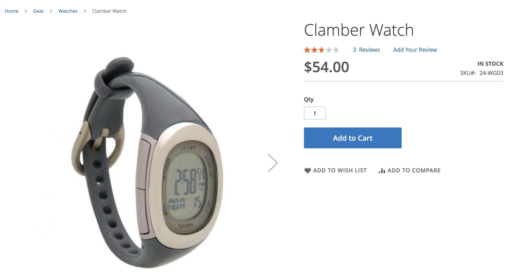
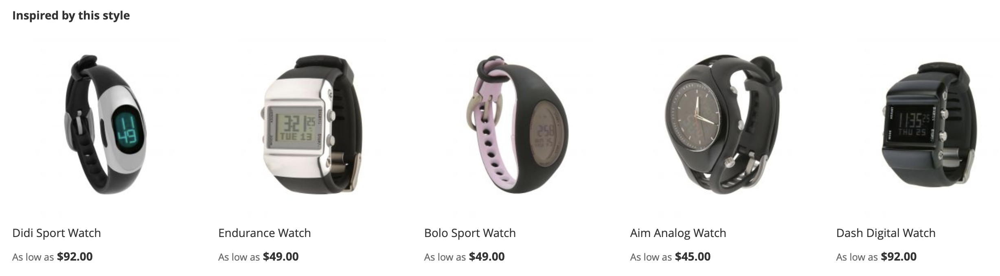

# レコメンデーションタイプ

Adobe Commerceには、サイトの様々なページにデプロイできるレコメンデーションのセットが多数用意されています。 あらゆるレコメンデーションタイプは、データドリブン型です。 行動データ、製品属性データ、指標にもとづいて構築されています。 簡単に参照できるように、レコメンデーションタイプは次のようにグループ化されています。

- [Personalized](#personalized)
- [クロスセルとアップセル](#crossup)
- [人気度](#popularity)
- [パフォーマンスの高い](#highperf)

レコメンデーションを使用する際は、ベストプラクティスとして、Adobeでは次のガイドラインを推奨しています。

- レコメンデーションタイプの多様化。 顧客は同じ商品を何度も提案するような場合、レコメンデーションを無視し始めます。

- 同じレコメンデーションをカートページと注文確認ページにデプロイしないでください。 買い物かごページには`Most Added to Cart`を、注文確認ページには`Bought This, Bought That`を使用することを検討してください。

- サイトの整理： 同じページに3つ以上のレコメンデーションユニットをデプロイしないでください。

- ストアで衣料品を販売している場合、`More like this`の推奨事項は、表示される製品の性別と一致しない性別に固有の製品を提案できます。 このレコメンデーションタイプは、衣料品以外のカテゴリでのみ使用することを検討してください。

>[!NOTE]
>
>この記事で説明されているイベントについて詳しくは、開発者ドキュメントの[ ストアフロントイベント ](https://developer.adobe.com/commerce/services/shared-services/storefront-events/#product-recommendations)を参照してください。

## データ要件と行動

商品レコメンデーションは、ストアフロントから収集した行動データに依存するデータ主導のシステムです。 レコメンデーションの質と量は、利用可能なイベントデータの量によって異なります。

>[!IMPORTANT]
>
>多くのレコメンデーションタイプでは、有意義な成果を生み出すために十分な行動データ（商品閲覧数、カートへの追加行動、購入など）を必要とします。 通常、正確なレコメンデーションを作成するには、数日間のアクティブな買い物客アクティビティが必要です。 サイトトラフィックが様々なレコメンデーションタイプの入力にどのように役立つかについては、[準備状況インジケーター](create.md#readiness-indicators)を参照してください。

### 不十分なデータではどうなるか

レコメンデーションを生成するのに十分なイベントデータがない場合、システムは次のことが可能になります。

- レコメンデーション単位の空の結果を返します。
- パーソナライズされたレコメンデーションがまだ利用できない場合に`Most viewed`商品を表示するなど、[ バックアップのレコメンデーション ](events.md#backup-recommendations)をトリガーします。
- レコメンデーション単位に[設定](create.md)より少ない製品を表示します。

## Personalized {#personalized}

レコメンデーションタイプでは、サイトにおける特定の買い物客の行動履歴にもとづいて、商品のレコメンデーションを行います。 たとえば、以前にジャケットを閲覧したり、サイトでジャケットを購入したりした買い物客は、これらのレコメンデーションにより、前回の続きから購入したり、他のジャケットや類似の商品をレコメンデーションしたりすることができます。

>[!NOTE]
>
>パーソナライズされたレコメンデーションを提供するには、買い物客の行動履歴を把握する必要があります。 十分なインタラクション履歴を持たない新規訪問者や買い物客には、サイトで十分な行動シグナルが生成されるまで、「最も閲覧された商品」などの[ バックアップのレコメンデーション ](events.md#backup-recommendations)が表示されます。

| タイプ | 説明 |
|---|---|
| あなたにおすすめ | 各買い物客の現在および過去のサイト内での行動にもとづいて商品をレコメンデーションします。 顧客の閲覧履歴と購買履歴にもとづいて、関連性の高いレコメンデーションを表示します。 このレコメンデーションタイプは、ほとんどの買い物客がサイトから買い物を始めるホームページで効果を発揮します。 Adobe Commerceでは、サイトで初めて体験をパーソナライズするシグナルを生成しなかった顧客に対して、最も閲覧されたレコメンデーションタイプに基づいた商品を表示します。 しかし、買い物客がサイト上で商品にやり取りを始めると、おすすめの商品は買い物客の行動に合わせてリアルタイムで調整されます。  **使用場所：** - ホームページ  - カテゴリ  - ページビルダー&#x200B;  **推奨ラベル：**  – あなたのためだけに  – お勧め  – お買い物のトレンドに触発 |
| 最近表示した項目 | 買い物客が最近閲覧した商品を、ブラウザーの履歴にもとづいて表示します。 削除された製品は、レコメンデーションユニットによって削除されます。 ブラウザの履歴がない場合や、フィルタールールが適用されている場合に十分な履歴がない場合、レコメンデーションユニットは表示されません。 結果に含まれる製品が設定された製品よりも少ない場合、レコメンデーションユニットには返された製品のみが表示されます。  **使用場所：** - ホームページ  - カテゴリ   – 製品の詳細 - カート   – 確認&#x200B;  **推奨ラベル：**  – 最近閲覧した  – 別の外観を見る |

## クロスセルとアップセル {#crossup}

これらのレコメンデーションタイプは、買い物客が他の買い物客の好きなものを見つけられるように、社会的証明および商品主導で、他の類似商品を見つけやすくします。 推奨される製品は、選択した製品を補完することがよくあります。

### レコメンデーションのページコンテキスト

クロスセルおよびアップセルのレコメンデーションタイプでは、レコメンデーションユニットが表示されるページのコンテキストを使用します。 そのコンテキストは、関連項目を見つける際に使用する製品または製品をシステムに伝えます。

- **商品詳細ページ** – 買い物客が閲覧している商品のSKUを使用します。
- **買い物かごページ** – 買い物客の買い物かごに入っている商品のSKUを使用します。
- **注文確認ページ** – 買い物客が完了したばかりの購入時のSKUを使用します。

同じレコメンデーションタイプでも、デプロイ場所によって異なる結果が得られる場合があります。 例えば、*閲覧した商品の詳細ページの*&#x200B;では、閲覧した商品をコンテキストとして使用しています。 買い物かごページでは、買い物かごの内容を使用します。 注文確認ページでは、完了した注文が使用されます。

>[!NOTE]
>
>「これを見て、これを見て、これを見て、それを購入した」、「これを購入した、それを購入した」レコメンデーションタイプは、単純な出現指標を使用するのではなく、より高度なコラボレーションフィルタリングアルゴリズムを使用し、人気のある製品に偏っていない&#x200B;*興味深い類似点*&#x200B;を探します。 これらのレコメンデーションタイプの情報に使用されるデータは、サイトでの複数のセッションから得られた買い物客の集計行動にもとづいています。 データは、サイトで一度だけセッション中に発生した買い物客の行動にもとづいていません。 これらのレコメンデーションタイプは、買い物客が、現在閲覧されている商品と組み合わせることが明らかでない関連商品を見つけるのに役立ちます。
>
>こうしたレコメンデーションタイプでは、有意義な相関関係を特定するために、製品をまたいだ実質的なインタラクションデータが必要です。 商品カタログの多様性が制限されている、またはトラフィックが少ないストアでは、十分な行動パターンが見つかるまで、レコメンデーションが少ない場合があります。

| タイプ | 説明 |
|---|---|
| 閲覧したページ | 現在閲覧している商品の閲覧頻度が不釣り合いに高い商品をレコメンドします。  **使用場所：**  – 製品の詳細  – 買い物かご  – 確認&#x200B;  **推奨ラベル：**  – この製品を閲覧したお客様（PDP） |
| 閲覧、購入 | 現在の商品を閲覧した後、買い物客が不釣り合いに多く購入する傾向がある商品をレコメンドします。 このタイプは、買い物客が気づいていない可能性のある商品を見つけるのに役立ちます。  **使用場所：**  – 製品の詳細  – 買い物かご  – 確認&#x200B;  **推奨ラベル：**  – これを最終的に購入した顧客  – 最終的に購入した顧客  – この製品を閲覧した後、他の人は何を購入しますか？ |
| 買った、買った | 買い物客が現在閲覧している商品に不釣り合いに多く購入する商品をレコメンドします。 このタイプでは、他の買い物客が購入した商品を集計することで、カートに追加できる関連性の高い商品を表示します。  **使用場所：**  – 商品の詳細  – 買い物かご  – 確認&#x200B;  **推奨ラベル：**  – 必要なものをすべて入手  – これらの  – よく一緒に購入します |
| その他 | 名前、説明、カテゴリ割り当て、属性など、類似のメタデータにもとづいて商品のレコメンデーションを行います。 ページコンテキストを提供する製品または製品の属性を評価することで、同じカテゴリの類似した製品をレコメンドします。 たとえば、買い物客がヨガマットを閲覧している場合は、機器カテゴリの他の商品をお勧めします。 このレコメンデーションタイプは性別を区別しないため、アパレル、ファッション、その他の性別に特化した業種には推奨されません。  **使用場所：**  – 製品の詳細 - カート   – 確認&#x200B;  **推奨ラベル：**  – この のような他の製品 – これに類似 |
| [視覚的な類似性](#visualsim) | ページのコンテキストを提供する商品に基づいて、類似した商品をレコメンドします。 このレコメンデーションタイプは、画像や商品の視覚的な側面がショッピング体験にとって重要である場合に最も役立ちます。 |

## 人気度 {#popularity}

これらのレコメンデーションタイプでは、過去7日以内に最も人気があった商品やトレンドの商品をレコメンデーションします。

>[!NOTE]
>
>人気にもとづくレコメンデーションには、ストアフロントからの十分なイベントデータが必要です。 ストアが新しい場合やトラフィックが少ない場合は、適切な行動データが収集されるまで、これらのレコメンデーションタイプから返される結果が限定的であったり、結果が出ないことがあります。 最適なパフォーマンスを確保するために、[ データ準備状況インジケーター](workspace.md)を監視します。

| タイプ | 説明 |
|---|---|
| 閲覧数 | 過去7日以内にビューアクションが発生したセッション数をカウントすることで、最も閲覧された製品をレコメンドします。  **使用場所：** - ホームページ  - カテゴリ   – 製品の詳細 - カート   – 確認 - ページビルダー&#x200B;  **推奨ラベル：**  – 最も人気のある - トレンド   – 現在人気  – 最近人気のある  – この製品に触発された人気製品（PDP）  - トップセラー |
| 最も購入された | 過去7日以内に買い物客が最も頻繁に購入した商品をレコメンドします。  **使用場所：** - ホームページ  - カテゴリ   – 製品の詳細 - カート   – 確認 - ページビルダー&#x200B;  **推奨ラベル：**  – 最も人気のある - トレンド   – 現在人気  – 最近人気のある  – この製品に触発された人気製品（PDP）  - トップセラー |
| 買い物かごに追加された回数 | 過去7日以内に買い物客がカートに最も頻繁に追加した商品をレコメンドします。 このレコメンデーションタイプは、すべてのページで使用できます。  **使用場所：** - ホームページ  - カテゴリ   – 製品の詳細 - カート   – 確認 - ページビルダー&#x200B;  **推奨ラベル：**  – 最も人気のある - トレンド   – 現在人気  – 最近人気のある  – この製品に触発された人気製品（PDP）  - トップセラー |
| トレンド | 過去7日以内にサイト内で発生した、最近の製品人気の勢いに基づいて製品をレコメンデーションします。  Adobe AIは、サイト全体の閲覧履歴と購入データを集計して、買い物客に最も最近人気のある商品を特定し、ランク付けします。 トレンド分析では、最近の製品売上の勢いを分析するため、回転率の高いカタログに最適なレコメンデーションタイプです。 カタログが静的な場合は、オーディエンスのショッピングパターンが変動していない限り、あまり役に立たない可能性があります。   ホームページで使用する場合、トレンドでは、サイト全体で最近人気のある商品をレコメンドします。 トレンドは、常に人気のある商品ではなく、最近人気のある商品を表示します。 たとえば、特定の商品をプロモーションするメールマーケティング施策がある場合、そのメールによって生成される人気度の増加は、プロモーションされた商品がトレンドに分類される可能性を高めます。  **使用場所：** - ホームページ  - カテゴリ   – 製品の詳細 - カート   – 確認 - ページビルダー&#x200B;  **推奨ラベル：** - トレンド  - トレンド中  – 最近トレンド中  – 注目の製品  – 関連製品（PDP） |

## 高いパフォーマンス {#highperf}

これらのレコメンデーションタイプは、カートへの追加率やコンバージョン率などの成功基準にもとづいて、最もパフォーマンスの高い商品をレコメンデーションします。

>[!NOTE]
>
>パフォーマンスの高いレコメンデーションタイプは、コンバージョンデータ（購入とカートへの追加アクション）にもとづいています。 コンバージョン量が少ない新しい店舗や店舗では、これらの推奨事項が有効になるまでに7～14日にわたってデータを収集する必要があります。

| タイプ | 説明 |
|---|---|
| 閲覧から購入へのコンバージョン | 購入確認のコンバージョン率が最も高い商品をレコメンドする。 製品ビューを登録した買い物客セッションのうち、最終的に購入を登録した買い物客の割合はどのくらいでしょうか。  **使用場所：** - ホームページ  - カテゴリ   – 製品の詳細 - カート   – 確認&#x200B;  **推奨ラベル：**  – 販売者  – 人気製品  – 興味があるかもしれません |
| カートへのコンバージョンを表示 | カートでの閲覧のコンバージョン率が最も高い商品をレコメンデーションする。 商品ビューを登録したすべての買い物客セッションのうち、最終的に買い物客がカートに追加を登録した割合はどのくらいでしょうか。  **使用場所：** - ホームページ  - カテゴリ   – 製品の詳細 - カート   – 確認&#x200B;  **推奨ラベル：**  – 販売者  – 人気製品  – 興味があるかもしれません |

## 視覚的な類似性 {#visualsim}

_視覚的な類似性_&#x200B;のレコメンデーションタイプでは、閲覧中の商品と類似した見た目の商品がレコメンドされます。 このレコメンデーションタイプは、商品の画像や視覚的な側面がショッピング体験の重要な部分である場合に最も役立ちます。

### 仕組み

_視覚的な類似性_&#x200B;のレコメンデーションタイプでは、現在表示されている画像と視覚的な類似性を持つカタログ内の他の商品に関するレコメンデーションが提供されます。 視覚的な類似性には、次のような側面があります。

- カラー
- シェイプ
- サイズ
- テクスチャ
- マテリアル
- Style

Adobe AIは、AIを活用してカタログ内の画像を処理および分析し、視覚的な類似性の判断に使用される属性を構築します。

>[!NOTE]
>
> 非実稼動環境でこのレコメンデーションタイプをテストする場合は、画像URLが一般にアクセス可能であることを確認してください。

>[!NOTE]
>
> 現在、製品画像のサイズは10 MB以下である必要があります。

このレコメンデーションタイプは、ほとんどのカタログには適用されないため、デフォルトでは有効になっていません。 このレコメンデーションタイプを明示的に有効にする必要があります。

### 視覚的な類似性レコメンデーションタイプの有効化

>[!NOTE]
>
> _視覚的な類似性_&#x200B;のレコメンデーションタイプは、オプションのモジュールとして[ インストール ](install-configure.md)すると使用できます。

1. _管理者_ サイドバーで、**マーケティング** > _プロモーション_ > **製品レコメンデーション**&#x200B;に移動して、_製品レコメンデーション_ ダッシュボードを表示します。

1. **設定** （歯車アイコン）をクリックして、_設定_ ページを表示します。

1. 「_ビジュアルレコメンデーション_」セクションで、「**ビジュアルレコメンデーションを有効にする**」を選択します。

1. 完了したら、**変更を保存**&#x200B;をクリックします。

   ページの種類が&#x200B;**製品の詳細**&#x200B;の場合、[新しい推奨事項を作成](create.md) ページに&#x200B;**視覚的な類似性**&#x200B;が選択可能な推奨事項の種類として表示されるようになりました。

ビジュアルレコメンデーションを有効にすると、Adobe AIは画像処理を開始します。 所要時間は、カタログのサイズによって異なります。

### 使用場所

- 商品詳細

### 推奨ストアフロントラベル

- あなたも好きかもしれません
- ほかにも気に入っていただけるかもしれません
- このスタイルに触発

### 例

次の画像は、_Clamber Watch_&#x200B;の製品詳細ページを示しています。

次に、_Clamber Watch_&#x200B;の&#x200B;_視覚的類似性_&#x200B;推奨単位を示します。

