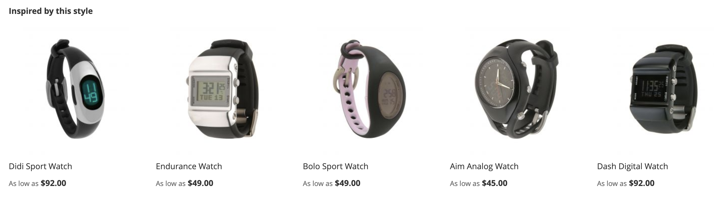

# レコメンデーションタイプ

Adobe Commerceには、サイトの様々なページにデプロイできる推奨事項の大きなセットが用意されています。 すべてのレコメンデーションタイプはデータ駆動型です。 行動データ、製品属性データおよび指標を利用します。 簡単に参照できるように、レコメンデーションタイプは次のようにグループ化されています。

- [パーソナライズ](#personalized)
- [クロスセルとアップセル](#crossup)
- [人気度](#popularity)
- [高パフォーマンス](#highperf)

ベストプラクティスとして、Adobeでは Recommendations を使用する際に次のガイドラインを推奨します。

- レコメンデーションタイプを多様化する。 お客様は、同じ製品を何度も提案すると、レコメンデーションを無視し始めます。

- 買い物かごページと注文確認ページに同じレコメンデーションをデプロイしないでください。 買い物かごページには `Most Added to Cart` を、注文確認ページには `Bought This, Bought That` を使用することを検討してください。

- サイトを整理しておきます。 同じページに 3 つを超えるレコメンデーションユニットをデプロイしないでください。

- 衣料品を販売する場合、`More like this` の推奨事項は、表示されている商品の性別に一致しない性別固有の商品を提案する可能性があります。 このレコメンデーションタイプは、衣料品以外のカテゴリにのみ使用することを検討してください。

>[!NOTE]
>
>この記事で説明されているイベントについて詳しくは、開発者ドキュメントの [&#x200B; ストアフロントイベント &#x200B;](https://developer.adobe.com/commerce/services/shared-services/storefront-events/#product-recommendations) を参照してください。

## データ要件と動作

Product Recommendations は、ストアフロントから収集された行動データに依存するデータ駆動型システムです。 レコメンデーションの質と量は、利用できるイベントデータの量によって異なります。

>[!IMPORTANT]
>
>ほとんどのレコメンデーションタイプでは、意味のある結果を生成するために十分な行動データ（製品表示、買い物かごへの追加アクション、購入など）が必要です。 正確なレコメンデーションを作成するには、通常、システムで数日のアクティブな買い物客アクティビティが必要です。 サイトトラフィックが様々なレコメンデーションタイプの入力にどのように役立つかについては、[&#x200B; 準備状況インジケーター &#x200B;](create.md#readiness-indicators) を参照してください。

### データが不十分な場合の処理

レコメンデーションを生成するのに十分なイベントデータがない場合、システムは次の操作を実行できます。

- レコメンデーションユニットに空の結果を返します。
- パーソナライズされたレコメンデーションがまだ利用できない場合に [&#x200B; 製品を表示するなど、トリガー](events.md#backup-recommendations) バックアップのレコメンデーション `Most viewed`。
- レコメンデーションユニットに表示する製品の数が [&#x200B; 設定済み &#x200B;](create.md) よりも少なくなっています。

## パーソナライズ {#personalized}

これらのレコメンデーションタイプは、サイトでの特定の買い物客の行動履歴に基づいて製品をレコメンデーションします。 例えば、買い物客が以前にジャケットを参照したり、サイトでジャケットを購入したりした場合、これらのレコメンデーションは基本的に出発点を取得し、他のジャケットや類似の製品をレコメンデーションします。

>[!NOTE]
>
>パーソナライズされたレコメンデーションでは、買い物客は行動履歴を確立する必要があります。 十分なインタラクション履歴のない新しい訪問者や買い物客には、サイトで十分な行動信号が生成されるまで、最も閲覧された製品などの [&#x200B; バックアップのレコメンデーション &#x200B;](events.md#backup-recommendations) が表示されます。

| タイプ | 説明 |
|---|---|
| あなたにお勧め | 各買い物客の現在および以前のオンサイト行動に基づいて製品を推奨します。 買い物客のブラウジングおよび購入履歴に基づいて、関連性の高いお勧めを表示します。 このレコメンデーションタイプは、ほとんどの買い物客がサイトでジャーニーを開始するホームページで有効です。 エクスペリエンスをパーソナライズするためのシグナルを生成していないサイトの初めての買い物客に対しては、Adobe Commerceでは、最も多く閲覧されたレコメンデーションタイプに基づいて商品が表示されます。 ただし、買い物客がサイト上の製品とやり取りを始めると、推奨製品は行動に合わせてリアルタイムで調整されます。  **使用場所：** - ホームページ  - カテゴリ   **推奨ラベル：**  – あなたにぴったりの   – あなたにおすすめの   – お買い物トレンドからインスピレーション |
| 最近表示された項目 | ブラウザー履歴に基づいて、買い物客が最後に表示した製品を表示します。 削除された製品は、レコメンデーションユニットによって削除されます。 ブラウザーの履歴がない場合や、フィルタールールを適用したときに十分な履歴がない場合、レコメンデーションユニットは表示されません。 結果に含まれる製品の数が設定されている数よりも少ない場合、推奨部には、返された製品のみが表示されます。  **使用場所：** - ホームページ  - カテゴリ   – 製品の詳細   – 買い物かご   – 確認   **提案ラベル：**  – 最近表示された項目   – もう一度見る |

## クロスセルとアップセル {#crossup}

これらのレコメンデーションタイプは、買い物客が他の人が気に入ったものを見つけるのに役立つソーシャルプルーフで、または製品で他の類似した製品を見つけるのに役立つ製品です。 推奨製品は、多くの場合、選択した製品を補完するものです。

>[!NOTE]
>
>「これを閲覧」、「これを閲覧」、「これを購入」、「これを購入」、「これを購入」の各レコメンデーションタイプでは、単純な発生指標ではなく、人気製品に偏っていない *興味深い類似性* を探すより高度な協調フィルタリングアルゴリズムを使用しています。 これらのレコメンデーションタイプに通知するために使用されるデータは、サイト上の複数のセッションから得られる買い物客の集計行動に基づいています。 データは、サイト上の単一のインセッション発生から得られる買い物客の行動には基づいていません。 これらのレコメンデーションタイプは、買い物客が、現在閲覧されている製品と組み合わせることが明らかでない可能性のある、隣接する製品を見つけるのに役立ちます。
>
>これらのレコメンデーションタイプでは、意味のある相関関係を特定するために、大量の製品間インタラクションデータが必要です。 製品カタログの多様性に制限があるか、トラフィックが少ない店舗では、十分な行動パターンが現れるまで、レコメンデーションが少ない場合があります。

| タイプ | 説明 |
|---|---|
| がこれを表示し、が表示されました | は、現在閲覧されている製品に対して、買い物客が不釣り合いに頻繁に閲覧する製品を推奨します。  **使用箇所：**  – 製品の詳細   – 買い物かご   – 確認   **推奨ラベル：**  – この製品を同時に表示した顧客（PDP） |
| これを閲覧し、次を購入 | 現在の製品を表示した後に、買い物客が不釣り合いに頻繁に購入する傾向がある製品を推奨します。 このタイプは、買い物客が気付かなかった商品を見つけるのに役立ちます。  **使用場所：**  – 製品の詳細   – 買い物かご   – 確認   **推奨ラベル：**  – この究極の購入品を閲覧した顧客   – 最終的に購入した顧客   – この製品を閲覧した後、他のユーザーが購入するものは？ |
| これを購入し、それを購入しました | は、現在閲覧されている製品に対して、買い物客が不釣り合いに頻繁に購入する製品を推奨します。 このタイプは、他の買い物客が現在の製品で購入したものを集計することで、買い物客が買い物かごに追加できる、関連性の高い製品を表示します。  **使用場所：**  – 製品の詳細   – 買い物かご   – 確認   **推奨ラベル：**  – 必要なものをすべて取得   – これらを忘れないでください   – 頻繁に購入 |
| その他の関連リソース | 名前、説明、カテゴリ割り当て、属性などの類似のメタデータに基づいて製品をレコメンデーションします。 このタイプでは、表示中の製品の属性を評価することで、同じカテゴリの類似した製品をお勧めします。 例えば、買い物客がヨガマットを閲覧している場合は、機器カテゴリの他の製品をお勧めします。 この推奨タイプは性別を区別しないため、アパレル、ファッション、その他の性別仕様には推奨されません。  **使用場所：**  – 製品の詳細   – 買い物かご   – 確認   **推奨ラベル：**  – このような製品をさらに   – 類似 |
| [&#x200B; 視覚的類似性 &#x200B;](#visualsim) | は、表示されている製品に類似した製品を推奨します。 このレコメンデーションタイプは、画像や商品の視覚的側面がショッピングエクスペリエンスにとって重要な場合に最も役立ちます。 |

## 人気度 {#popularity}

これらのレコメンデーションタイプでは、過去 7 日間で最も人気のある製品やトレンドの製品をお勧めします。

>[!NOTE]
>
>人気度ベースのレコメンデーションには、ストアフロントからの十分なイベントデータが必要です。 ストアが新しい場合やトラフィックが少ない場合、これらのレコメンデーションタイプは、適切な行動データが収集されるまで、限定的な結果を返したり、結果を返さない場合があります。 [&#x200B; データ準備状況インジケーター &#x200B;](workspace.md) を監視して、最適なパフォーマンスを確保します。

| タイプ | 説明 |
|---|---|
| 最も頻繁に閲覧された | では、過去 7 日間に表示アクションが発生したセッション数をカウントして、最も多く表示された製品をお勧めします。  **使用箇所：** - ホームページ  - カテゴリ   – 製品の詳細  - カート   – 確認   **提案ラベル：**  – 一番人気   – 話題   – 今人気   – 最近人気   – この製品にインスピレーションを得た人気製品（PDP）  - トップセラー |
| 最も多く購入された | では、過去 7 日以内に買い物客が最も頻繁に購入した製品を推奨します。  **使用箇所：** - ホームページ  - カテゴリ   – 製品の詳細   – 買い物かご   – 確認   **推奨ラベル：**  – 一番人気   – 話題   – 今人気   – 最近人気   – この製品にインスピレーションを得た人気製品（PDP）  - トップセラー |
| 買い物かごに追加済み | 過去 7 日以内に買い物客が買い物かごに最も頻繁に追加した製品を推奨します。 このレコメンデーションタイプは、すべてのページで使用できます。  **使用箇所：** - ホームページ  - カテゴリ   – 製品の詳細   – 買い物かご   – 確認   **推奨ラベル：**  – 一番人気   – 話題   – 今人気   – 最近人気   – この製品にインスピレーションを得た人気製品（PDP）  - トップセラー |
| トレンド | では、サイト全体での製品の人気の最近の勢いに基づいて製品をお勧めします。  Adobe Senseiは、サイト全体のブラウジングおよび購入データを集計し、買い物客に最近人気のある商品を特定してランク付けします。 Trending は最近の製品の勢いを分析するので、売上高の多いカタログに対する効果的なレコメンデーションタイプです。 カタログがより静的な場合、オーディエンスのショッピングパターンが大きく変化しない限り、あまり役に立たない可能性があります。   ホームページで使用する場合、Trending では、サイト全体で最近人気のある製品を推奨します。 トレンドには、常に人気のある製品ではなく、最近人気が出た製品が表示されます。 例えば、特定の製品をプロモーションするメールマーケティングキャンペーンがある場合、メールによって生み出される人気度の増加により、プロモーションされた製品がトレンドとして分類される可能性が高くなります。  **使用箇所：** - ホームページ  - カテゴリ   – 製品の詳細   – 買い物かご   – 確認   **提案ラベル：**  – 傾向   – 現在の傾向   – 最近の傾向   – 注目の製品   – 傾向を示す関連製品（PDP） |

## 高パフォーマンス {#highperf}

これらのレコメンデーションタイプは、買い物かごへの追加やコンバージョン率などの成功基準に基づいて、最もパフォーマンスの高い製品を推奨します。

>[!NOTE]
>
>パフォーマンスの高いレコメンデーションタイプは、コンバージョンデータ（購入と買い物かごへの追加アクション）に依存します。 コンバージョン量の少ない新しいストアまたはストアは、これらの推奨事項が有効になるまでに 7～14 日にわたってデータを収集する必要がある場合があります。

| タイプ | 説明 |
|---|---|
| 購入コンバージョンを表示 | 表示から購入へのコンバージョン率が最も高い製品をお勧めします。 製品表示を登録したすべての買い物客セッションのうち、最終的に買い物客による購入を登録した割合。  **使用場所：** - ホームページ  - カテゴリ   – 製品の詳細   – 買い物かご   – 確認   **提案ラベル：**  – トップセラー   – 人気の製品   – 興味があるかもしれません |
| 買い物かごへのコンバージョンを表示 | 買い物かごへのコンバージョン率が最も高い製品をお勧めします。 製品表示を登録したすべての買い物客セッションのうち、最終的に買い物客によって買い物かごに追加が登録された割合。  **使用場所：** - ホームページ  - カテゴリ   – 製品の詳細   – 買い物かご   – 確認   **提案ラベル：**  - トップセラー   – 人気の製品   – 興味があるかもしれません |
| 最も多く購入された | このレコメンデーションタイプは、「トップセラー」とも呼ばれ、過去 7 日間に注文アクションが発生したセッション数をカウントします。 このレコメンデーションタイプは、すべてのページで使用できます。  **使用箇所：** - ホームページ  - カテゴリ   – 製品の詳細   – 買い物かご   – 確認   **推奨ラベル：**  – 一番人気   – 話題   – 今人気   – 最近人気   – この製品にインスピレーションを得た人気製品（PDP）  - トップセラー |
| 買い物かごに追加済み | 過去 7 日以内に買い物客が買い物かごに最も頻繁に追加した製品を推奨します。 このレコメンデーションタイプは、すべてのページで使用できます。  **使用箇所：** - ホームページ  - カテゴリ   – 製品の詳細   – 買い物かご   – 確認   **推奨ラベル：**  – 一番人気   – 話題   – 今人気   – 最近人気   – この製品にインスピレーションを得た人気製品（PDP）  - トップセラー |

## 視覚的類似性 {#visualsim}

_視覚的類似性_ レコメンデーションタイプでは、表示される製品と類似した外観の製品をお勧めします。 このレコメンデーションタイプは、商品の画像や視覚的側面がショッピング体験の重要な部分である場合に最も役立ちます。

### 仕組み

_視覚的類似性_ レコメンデーションタイプは、現在表示されている画像と視覚的類似性を持つ、カタログ内の他の製品のレコメンデーションを提供します。 視覚的類似性には、以下のような側面が含まれます。

- カラー
- 形状
- サイズ
- テクスチャ
- 素材
- スタイル

Adobe Senseiは、AI を使用してカタログ内の画像を処理および分析し、視覚的な類似性の判断に使用される属性を構築します。

>[!NOTE]
>
> 非実稼動環境でこのレコメンデーションタイプをテストする場合は、画像 URL が公開されていることを確認します。

>[!NOTE]
>
> 現在、製品画像のサイズは 10 MB 以下である必要があります。

このレコメンデーションタイプはほとんどのカタログに適用されないので、デフォルトでは有効になっていません。 このレコメンデーションタイプを明示的に有効にする必要があります。

### 視覚的類似性推奨タイプを有効にする

>[!NOTE]
>
> _視覚的類似性_ レコメンデーションタイプは、オプションモジュールとして [&#x200B; インストール &#x200B;](install-configure.md) すると使用できます。

1. _管理者_ サイドバーで、**マーケティング**/_プロモーション_/**製品レコメンデーション** に移動して、_製品レコメンデーション_ ダッシュボードを表示します。

1. **設定** （歯車アイコン）をクリックして _設定_ ページを表示します。

1. 「_ビジュアルレコメンデーション_」セクションで、「**ビジュアルレコメンデーションを有効にする** を選択します。

1. 完了したら、「**変更を保存**」をクリックします。

   [&#x200B; 新しいレコメンデーションを作成 &#x200B;](create.md) ページで、ページタイプが **製品の詳細** の場合、選択可能なレコメンデーションタイプとして **ビジュアルな類似性** が表示されるようになりました。

ビジュアルレコメンデーションを有効にすると、Adobe Senseiが画像処理を開始します。 所要時間は、カタログのサイズによって異なります。

### 使用される場所

- 製品の詳細

### 推奨ストアフロントラベル

- 次のような方にも適しています。
- お気に入りの製品が見つかりました
- このスタイルからインスピレーションを得た

### 例

以下の画像は、_クランバーウォッチ_ の製品詳細ページです。

以下は _Clamber Watch_ の _視覚的類似性_ レコメンデーションユニットです。

