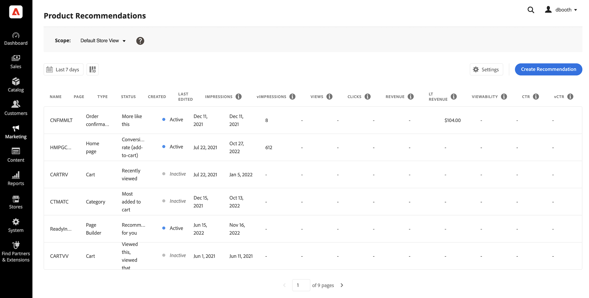
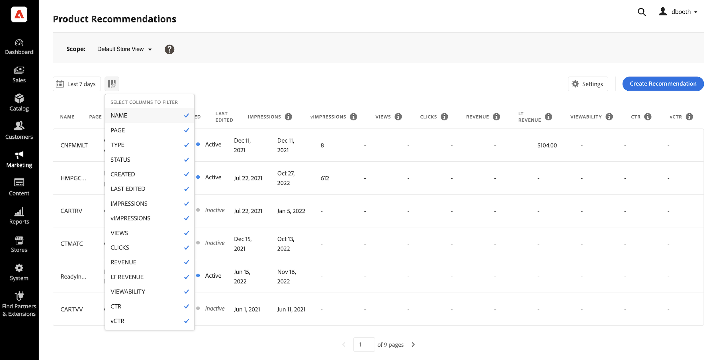
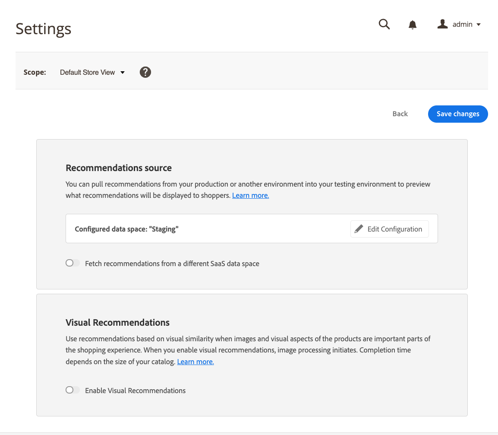
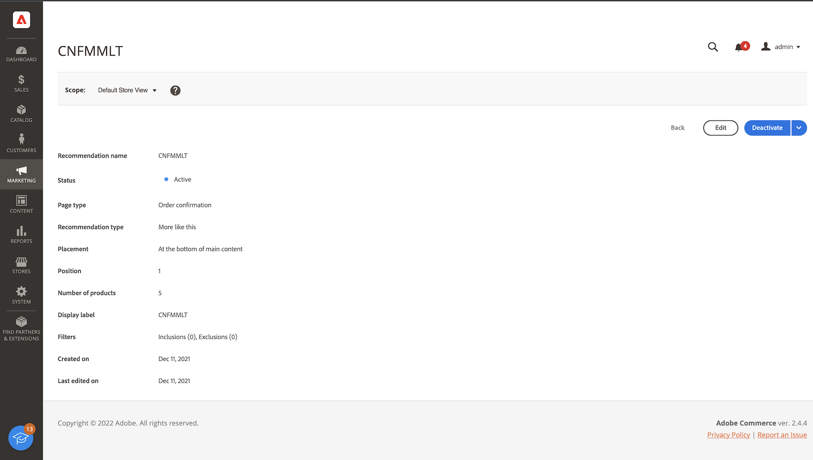

# [!DNL Product Recommendations] Workspace

[!DNL Product Recommendations] ワークスペースには、以前に設定したレコメンデーションのリストと、各レコメンデーションの成功を追跡するのに役立つ指標が表示されます。 リストは、最終日、週、または月の指標を計算するように設定できます。 この指標を使用して、レコメンデーションユニットの閲覧頻度やクリック数にもとづいて実用的なインサイトを獲得したり、レコメンデーションのパフォーマンスを分析したりできます。

>[!INFO]
>
>レコメンデーションユニットは、推奨製品&#x200B;_個のアイテム_&#x200B;を含むウィジェットです。

_推奨事項Workspace_

## データ収集

ワークスペースの各機能領域に正しいデータが含まれていることを確認するには、選択したストアフロント実装に基づいてデータ収集を設定する必要があります。

1. Luma - データ収集は標準で利用可能です。
1. ヘッドレス – データ収集は、ストアフロントの実装に応じて手動で設定する必要があります。

ヘッドレスストアフロントを使用している場合は、追加する必要がある必須イベントについて詳しくは、次のドキュメントを参照してください。

- 商品レコメンデーションダッシュボードの[必要なイベント ](events.md)。
- 前提条件として追加する必要がある[ ストアフロントイベントコレクター](https://developer.adobe.com/commerce/services/shared-services/storefront-events/collector/)です。
- イベント構造の[例](https://github.com/adobe/commerce-events/tree/main/examples)。

## 範囲の設定

最初は、すべてのレコメンデーション設定の[ スコープ ](https://experienceleague.adobe.com/docs/commerce-admin/start/setup/websites-stores-views.html)が`Default Store View`に設定されます。 Commerceのインストールに複数のストアビューが含まれる場合は、推奨事項が適用される&#x200B;**Scope**&#x200B;を[ ストアビュー](https://experienceleague.adobe.com/docs/commerce-admin/start/setup/websites-stores-views.html#scope-settings)に設定します。

## 指標の日付範囲の設定

1. **カレンダー**  コントロールをクリックします。

1. 次のいずれかを選択します。

   - 過去24時間
   - 過去7日間
   - 過去30日間

   指標の列の計算値は、現在の日付範囲を反映するように変更されます。

   >[!NOTE]
   >
   >製品レコメンデーション指標は、Luma ストアフロント用に最適化されています。 ストアフロントがLuma ベース以外の場合、指標がデータを追跡する方法は、[ イベントコレクションの実装方法](events.md)によって異なります。

## 列の表示/非表示

1. 左上隅で、**表示/非表示** 列をクリックします。

   表示されている列には青いチェックマークが付いています。

1. メニューで、次のいずれかの操作を行います。

   - 非表示の列を表示するには、チェックマークを付けずに任意の列名をクリックします。
   - 表示されている列を非表示にするには、チェックマークが付いている任意の列名をクリックします。

   選択した列のみを含めるように、テーブルが更新されます。

   
   _列の表示/非表示_

## 設定

設定により、レコメンデーションと行動データを提供するSaaS データスペースが決まります。

- レコメンデーションと行動データの生成元を変更するには、別のSaaS データスペースを選択します。

- 新しいSaaS データスペースを設定するには、**設定を編集**&#x200B;をクリックします。 詳しくは、[設定](settings.md)を参照してください。

_推奨事項の設定_

## 詳細を表示

1. テーブルで、確認する推奨事項をクリックします。

   
   _ホームページのコンバージョン率の詳細_

1. レコメンデーションのステータスを変更するには、「**アクティブ化**」または「**非アクティブ化**」をクリックします。

## レコメンデーションを編集

レコメンデーションの詳細ページで、**編集**&#x200B;をクリックします。 詳しくは、[推奨事項の編集](edit.md)にアクセスしてください。

## レコメンデーションを作成

レコメンデーションの詳細ページで、**作成**&#x200B;をクリックします。 詳しくは、[推奨事項の作成](create.md)にアクセスしてください。

## Workspace Controls

| 制御 | 説明 |
|---|---|
|  | 指標の計算に使用する時間の範囲を指定します。 オプション：24時間/7日/30日 |
|  | [!DNL Product Recommendations] テーブルに表示される列を決定します。 |
| 設定 | レコメンデーションと行動データが取得されるSaaS データスペースを決定し、視覚的な類似性レコメンデーションタイプも有効にします。 |
| レコメンデーションを作成 | [新しいレコメンデーションの作成](create.md) ページを開きます。 |

## 列の説明

| 列 | 説明 |
|---|---|
| 名前 | レコメンデーションの名前。 |
| ページ | レコメンデーションが表示されるページ。 |
| タイプ | レコメンデーションタイプ。 |
| ステータス | レコメンデーションステータス： オプション：非アクティブ/アクティブ/ドラフト |
| Created | レコメンデーションが作成された日付。 |
| 最終編集日 | レコメンデーションが最後に編集された日付 |
| インプレッション | レコメンデーションユニットがページに読み込まれ、レンダリングされる回数。 買い物客が閲覧していなくても、ブラウザーのビューポートのフォールドの下にあるレコメンデーションユニットが、ページ上にレンダリングされます。 この場合、レンダリングされたユニットはインプレッションとしてカウントされますが、ビューは買い物客がユニットをスクロールして表示する場合にのみカウントされます。 |
| インプレッション | （表示可能インプレッション） 1つ以上のビューを登録するレコメンデーションユニットの数。 たとえば、レコメンデーションユニットに2行があり、それぞれに2つの商品があり、最後の2つの商品が買い物客に表示されないが、最初の2つはインプレッションとしてカウントされる。 |
| ビュー | 買い物客のブラウザーのビューポートに表示されるレコメンデーションユニットの数。 買い物客がページを何度か上または下にスクロールすると、ユニットが表示されるたびにイベントが複数回起動します。 |
| クリック数 | 買い物客がレコメンデーションユニット内の項目をクリックした回数と、買い物客がレコメンデーションユニット内の「**カートに追加**」ボタンをクリックした回数の合計 |
| 収益 | 現在の期間のレコメンデーションによって導かれる収益。 |
| 収益の低下 | （ライフタイム収益） レコメンデーションによって推進されるライフタイム収益。 |
| 視認性 | ビューに登録するレコメンデーションユニットの割合。 |
| CTR | （クリック率） クリックを登録するレコメンデーションの単位インプレッションの割合。 CTRでは、単位が買い物客のビューに入らない場合でも、すべてのインプレッションがカウントされます。 レコメンデーションユニットが表示されない場合、クリックされる可能性は低くなります。 ただし、これらのインプレッションはCTR スコアにカウントされ、CTR全体のパーセンテージが低下します。 |
| vCTR | （表示可能なクリック率）は、表示可能なインプレッション（買い物客の画面の表示部分に実際に表示されたレコメンデーション）にもとづいてクリック数を測定し、より正確なエンゲージメントを提供します。 |
