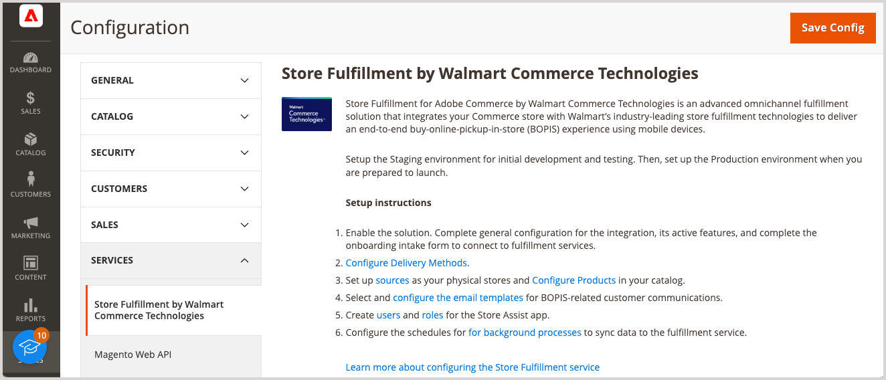

# [!DNL Store Fulfillment] の概要

Store Fulfillment for Adobe Commerce by Walmart Commerce Technologies は、お客様の [!DNL Commerce] 店舗と連携して、優れたオンライン購入、店舗での受け取り（BOPIS）カスタマーエクスペリエンスを提供する高度なオムニチャネルフルフィルメントソリューションです。

ストアフルフィルメントは、マーチャントがコンバージョン率、平均注文額、顧客満足度を向上させながらコストを削減するのに役立つエンドツーエンドのフルフィルメントワークフローも提供します。 このワークフローの特長は次のとおりです。

* **オムニチャネルの柔軟性** – 店舗や倉庫をピックアップポイントおよびフルフィルメントセンターに変えます。

* **便利な集客オプション** – オンライン購入を選択しながら、商品の在庫状況を簡単に確認し、店舗または縁側の集客を選択できます。

* **フルフィルメントの効率** - Store Assist モバイルアプリケーションは、店舗の担当者が注文のフルフィルメントの速度と精度を向上させるのに役立ちます。

* **モバイルの利便性** – お客様は、すべてのステップで注文通知を受け取ります。 注文確認から注文の受け取りまで、注文ステータスの追跡、チェックイン手順の取得、店舗に到着した際の店員とのコミュニケーションが可能です。

* **オペレーションの可視性**：店舗レベルでの在庫割り当てを向上させ、地域でのタイムリーな履行を促進します。

## Store Fulfillment 拡張機能

ストアフルフィルメントソリューションは、Adobe Commerceのネイティブ機能をサポートおよび強化します。

* シンプル、構成可能、グループ化、バンドル、仮想など、ほとんどの製品タイプをサポート

* [[!DNL Adobe Commerce] Inventory management](https://experienceleague.adobe.com/ja/docs/commerce-admin/inventory/basics/sources-stocks) との統合

* ERP、OMS、WMS などの POS （販売時点管理）システムと統合

* Luma テーマと完全互換性があります

* PWAおよびヘッドレスストアフロントとの部分的な互換性

* は、ウォルマートCommerceテクノロジーズのストアアシストアプリをサポートしています。 このアプリは、選択した店舗の従業員のハンドヘルドデバイスに集荷注文情報を直接配信します。 この情報を使用すると、顧客が店舗に到着した際に、すばやく正確に商品を選択、ステージング、引き渡すことができます。

## ストアシストアプリ

iOSおよびAndroid デバイス用のストアアシストアプリは、[!DNL Walmart Commerce Technologies] とやり取りして、オムニチャネルフルフィルメント機能を小売店に提供します。

* 店舗内および店舗側の集荷注文を店員のモバイル デバイスに直接送信する

* 店舗に到着して注文を受け取る際に、店舗の注文を迅速かつ正確に選択、ステージング、顧客に引き渡すようにします

* セキュリティポリシー、2 要素認証などのストア関連ユーザーアクセスを管理します

* 小売店の場所と在庫に関するデータをAdobe Commerceに自動的に同期します

## ユーザーエクスペリエンスの強化

ストアフルフィルメントは、ショッピングエクスペリエンスの改善とフルフィルメントワークフローの合理化を実現する機能を追加することで、Adobe Commerceを強化します。

* **店舗場所セレクター（SLS）** - ネイティブのチェックアウトに加えて、店舗のピックアップオプション、在庫の可用性、店舗のセレクターを商品ページと買い物かごページに追加します。

* **在庫の可用性** - Adobe Commerce Inventory managementに製品およびグローバル設定オプションを追加します。 これらのオプションは、店舗レベルの在庫割り当てをサポートし、タイムリーなローカルフルフィルメントを促進します。

* **買い物かごおよびチェックアウトの機能強化** - オンラインショッピングセッション中に、顧客が最速の利用可能なピックアップ時間、場所、コストを伝えます。

* **チェックインプロセスフロー** – 顧客のチェックインプロセスを改善するインターフェイスを追加し、店舗への到着時や店員とのインタラクション時に店舗内またはカーブサイドの受け取りを改善します。

* **マイアカウント履歴** - [!DNL Commerce] アカウント履歴を拡張して、注文履歴に手順を表示します。

* **トランザクションメール** - オンライン購入 [!UICONTROL Sales Emails] ストアトランザクション受信用のメールテンプレートを追加できるように管理機能を拡張します。 テンプレートは、注文受け取りプロセス中に、顧客と店員の間のリアルタイムの通信をサポートします。

* **柔軟なフルフィルメント** -[!DNL Commerce] の機能を拡張して、バックオーダーの処理、数量の削減、部分的な注文のフルフィルメントなどのシナリオをサポートすると同時に、これらのシナリオのサポートに必要なキャンセルやクレジットメモを容易にします。

>[!TIP]
>
> ストアフルフィルメントソリューションの簡単なデモについては、_Adobe Commerceのビデオとチュートリアル [&#128279;](https://experienceleague.adobe.com/docs/commerce-learn/tutorials/orders/store-fulfillment.html?lang=ja) にある  ストアフルフィルメントの概要_ を参照してください。

